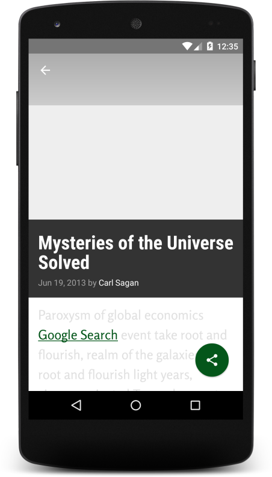
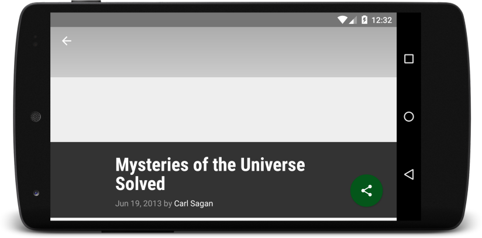
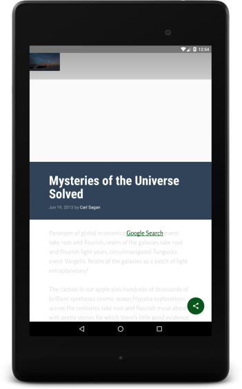

# adn5-xyzreader
AD nanodegree - Project 5: Make Your App Material

by CChevalier, Feb. 2016

## Rubric

#### Required behavior 

1.  App conforms to common standards found in the [Android Nanodegree General Project Guidelines](http://udacity.github.io/android-nanodegree-guidelines/core.html)

2.  App uses the Design Support library and its provided widget types (FloatingActionButton, AppBarLayout, SnackBar, etc).

3.  App uses CoordinatorLayout for the main activity.

4.  App theme extends from AppCompat.

5.  App uses an app bar and associated toolbars.

6.  App provides a Floating Action Button (FAB) for the most common action(s).

7.  App properly specifies elevations for app bars, FABs, and other elements specified in the [Material Design specification](http://www.google.com/design/spec/material-design/introduction.html).

8.  App provides sufficient space between text and surrounding elements.

9.  App has a consistent color theme defined in styles.xml.

10. Color theme does not impact usability of the app.

11. App uses images that are high quality, specific, and full bleed.

12. App uses fonts that are either the Android defaults, are complementary, and aren't otherwise distracting.

## Snapshots (before)

### Phone (Nexus 5)
.  .  

### 7in Tablet (Nexus 7)
.  .  

